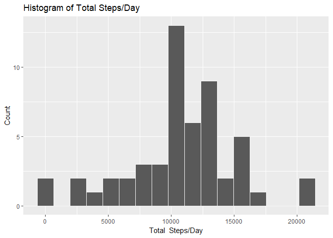
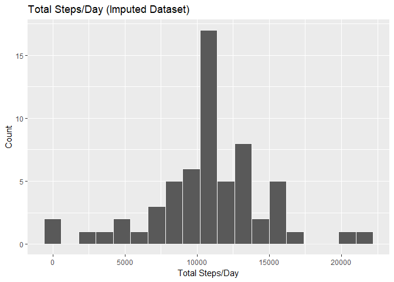
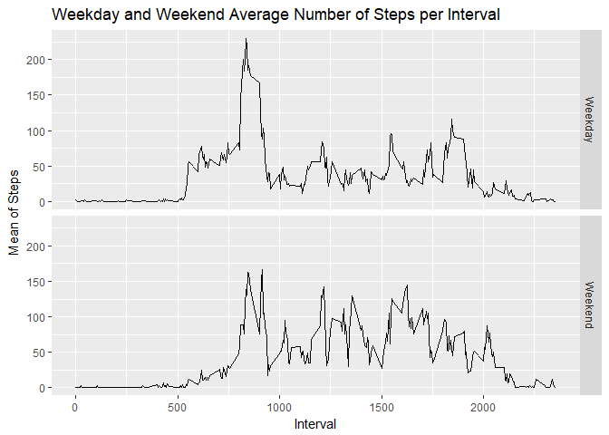

# Reproducible Research: Peer Assessment 1


## Loading and preprocessing the data

```r
library(knitr)
library(dplyr)
```

```
## 
## Attaching package: 'dplyr'
```

```
## The following objects are masked from 'package:stats':
## 
##     filter, lag
```

```
## The following objects are masked from 'package:base':
## 
##     intersect, setdiff, setequal, union
```

```r
library(ggplot2)

unzip(zipfile="activity.zip")
data <- read.csv("activity.csv")
head(data)
```

```
##   steps       date interval
## 1    NA 2012-10-01        0
## 2    NA 2012-10-01        5
## 3    NA 2012-10-01       10
## 4    NA 2012-10-01       15
## 5    NA 2012-10-01       20
## 6    NA 2012-10-01       25
```

```r
str(data)
```

```
## 'data.frame':	17568 obs. of  3 variables:
##  $ steps   : int  NA NA NA NA NA NA NA NA NA NA ...
##  $ date    : Factor w/ 61 levels "2012-10-01","2012-10-02",..: 1 1 1 1 1 1 1 1 1 1 ...
##  $ interval: int  0 5 10 15 20 25 30 35 40 45 ...
```

```r
summary(data)
```

```
##      steps                date          interval     
##  Min.   :  0.00   2012-10-01:  288   Min.   :   0.0  
##  1st Qu.:  0.00   2012-10-02:  288   1st Qu.: 588.8  
##  Median :  0.00   2012-10-03:  288   Median :1177.5  
##  Mean   : 37.38   2012-10-04:  288   Mean   :1177.5  
##  3rd Qu.: 12.00   2012-10-05:  288   3rd Qu.:1766.2  
##  Max.   :806.00   2012-10-06:  288   Max.   :2355.0  
##  NA's   :2304     (Other)   :15840
```

```r
completelogical <- complete.cases(data)
data.complete <- data[completelogical,]
```

## What is mean total number of steps taken per day?

```r
daily.data <- group_by(data.complete, date)
daily.data <- summarize(daily.data, steps=sum(steps))

hist <- ggplot(data = daily.data, aes(steps)) + 
        geom_histogram(binwidth = 1300, colour = "gray97") +
        xlab("Total  Steps/Day") +
        ylab("Count") +
        ggtitle("Histogram of Total Steps/Day")
print(hist)
```

<!-- -->

```r
mean(daily.data$steps)
```

```
## [1] 10766.19
```

```r
median(daily.data$steps)
```

```
## [1] 10765
```

## What is the average daily activity pattern?

```r
data.fivemin <- group_by(data.complete, interval)
data.fivemin <- summarize(data.fivemin, steps=mean(steps))

timeplot1 <- ggplot(data.fivemin, aes(interval, steps)) + 
        geom_line()
print(timeplot1)
```

<!-- -->

```r
data.fivemin[which(data.fivemin$steps == max(data.fivemin$steps)),]
```

```
## # A tibble: 1 x 2
##   interval    steps
##      <int>    <dbl>
## 1      835 206.1698
```

## Imputing missing values

```r
NARows <- nrow(data) - nrow(data.complete)
NARows
```

```
## [1] 2304
```

```r
meanreplacer <- function(num) 
        replace(num, is.na(num), 
        mean(num, na.rm = TRUE))

replaced.data <- (data %>% group_by(interval) %>% mutate(steps = meanreplacer(steps)))

data2 <- as.data.frame(replaced.data)

totsteps <- aggregate(data2$steps, by = list(data2$date), FUN = sum)
names(totsteps)[names(totsteps) == "x"] <- "Total"
names(totsteps)[names(totsteps) == "Group.1"] <- "Date"
hist2 <- ggplot(data = totsteps, aes(Total)) + 
        geom_histogram(binwidth = 1200, colour = "gray97") +
        xlab("Total Steps/Day") +
        ylab("Count") +
        ggtitle("Total Steps/Day (Imputed Dataset)")
print(hist2)
```

<!-- -->

```r
mean(totsteps$Total)
```

```
## [1] 10766.19
```

```r
median(totsteps$Total)
```

```
## [1] 10766.19
```

## Are there differences in activity patterns between weekdays and weekends?

```r
data2$WeekendOrWeekday <- ifelse(weekdays(as.Date(data2$date)) %in% c("Monday", "Tuesday", "Wednesday", "Thursday", "Friday"), "Weekday", "Weekend")

data2 <- (data2 %>% group_by(interval, WeekendOrWeekday) %>% summarise(Mean = mean(steps)))

timeplot2 <- ggplot(data2, mapping = aes(x = interval, y = Mean)) + 
        geom_line() +
        facet_grid(WeekendOrWeekday ~.) + 
        xlab("Interval") + 
        ylab("Mean of Steps") +
        ggtitle("Weekday and Weekend Average Number of Steps per Interval")
print(timeplot2)
```

<!-- -->
